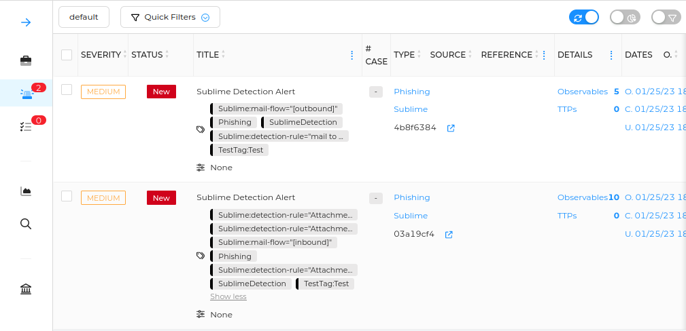
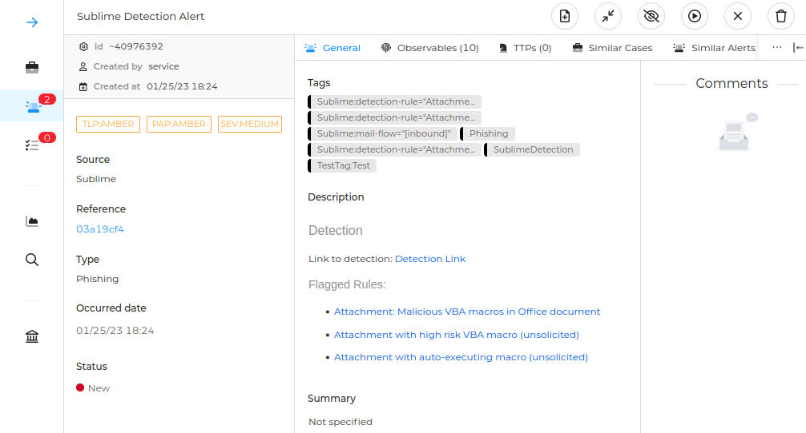
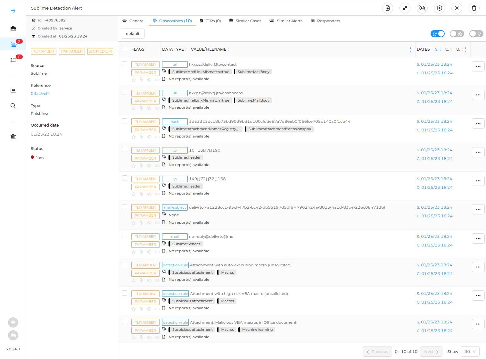

  
  
<!--    -->

# HiveLime
Hivelime is a comprehensive integration between [TheHive](https://www.strangebee.com/thehive/) and [Sublime](https://sublimesecurity.com/). Utilizing Sublime webhooks, Hivelime can be effortlessly configured to create alerts on TheHive!

# Functionalities
* Triggered event (malicious email detection) is parsed and converted into an actionable TheHive alert with tags, observables;
* Request signing can be used if `SUBLIME_SIGNING_KEY` variable is provided;
* Observables have detailed tags to further analyze, filter or use in remediation step;
* Built with both Security and OPS in mind. _HiveLime_ has small footprint, great performance on various workloads and easily deployable with minimal configuration;
* Tags can be provided in configuration to be appended to alerts created by _HiveLime_;
* Alert has a brief summary description with links to detection, flagged rules and important information.

# Alert Examples

# Usage
* Parameters should be provided via environment variables. Please see [docker-compose file](docker-compose.yml).
* Run the app via docker or via simply `./hivelime`
* _HiveLime_ will listen `http://SERVER_ADDRESS/sublime/event`. Make sure to provide `/sublime/event` url resource to Sublime Webhook action configuration.

## Notes
* Alert reference is first 8 chars of detection CanonicalID;

# Setup & Compile Instructions
## Get latest compiled binary from releases
1. Check [Releases](https://github.com/KaanSK/hivelime/releases/latest)  section.

## Compile from source code
1. Make sure that you have a working Golang workspace.
2. `go build .`
    * `go build -ldflags="-s -w" .` could be used to customize compilation and produce smaller binary.

## Using Public Container Registries
* `docker pull ghcr.io/kaansk/hivelime`

## Using [Dockerfile](Dockerfile)
1. Edit [config file](conf.yaml) or provide environment variables to commands bellow
2. `docker build -t hivelime .`
3. `docker run -it hivelime`

## Using [docker-compose file](docker-compose.yml)
1. Edit environment variables and configurations in [docker-compose file](docker-compose.yml)
2. `docker-compose run -d`

# Credits
* [Sublime Security](https://sublimesecurity.com/)
* [Dockerfile Reference](https://www.cloudreach.com/en/resources/blog/cts-build-golang-dockerfiles/) 
* Release management with [GoReleaser](https://goreleaser.com)
* [Delivr.to](https://delivr.to/)